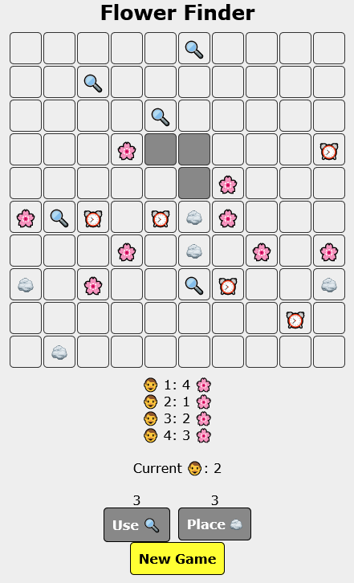

# Flower Finder

  

## Table of contents
- [**About**](#about)
- [**Game rules**](#game-rules)
- [**Installation**](#installation)
- [**Screenshot**](#screenshot)
- [**License**](#license)
- [**Contribution**](#contribution)
- [**Donations**](#donations)
- [**Star history**](#star-history)

## About

- Flower Finder is a strategy game for 2 or more players.

## Game Rules

### Game Objective

- The objective of the game is to find as many flowers as possible on the board.

### The game board

- The game board is square and is of an optional size.
- At the beginning of the game, all game board fields are covered and all the objects are randomly placed under the fields.
- Each square can contain a flower, a stone, a magnifying glass, a clock or be empty.

### Game settings

- Before the game begins, the following is determined:
  - Number of players (2 - 8)
  - Size of playing area (10x10 - 30x30, default 20x20)
  - Number of flowers (1 - 30, default 20)
  - Number of stones (0 - 10, default 5)
  - Number of magnifying glasses (0 - 10, default 5)
  - Number of clocks (0 - 10, default 5)

### Game start

- When the game starts, players take turns. In each turn, a player has the option to take one of the following actions:
  - Choose which field to reveal (only fields that have not yet been revealed can be revealed)
  - Use an item:
    - Magnifying glass: reveals all the objects not only on the selected field, but also on all the fields around it (i.e. reveals 3x3 fields instead of one)
    - Clock: Allows the player to make another action in the same turn
    - Stone: the player chooses on which square in the board he wants to place the stone. The stone ensures that the opposing player cannot reveal any square that is horizontally and vertically on the same level as the placed stone. The stone can only be placed on already revealed squares.

### Game ending

- Game Ending: the game ends when all flowers on the game board are collected or when no player has the opportunity to make another move. The game can end with one player winning or a draw.

## Installation

- Get the latest version of this repository: [**Download**](https://github.com/libersoft-org/flower-finder/archive/refs/heads/main.zip)
- Unpack the zip file
- Open **index.html** file, located in **src** subdirectory in your web browser

## Screenshot

 

## License

This software is developed as open source under [**Unlicense**](./LICENSE).

## Contribution

If you are interested in contributing to the development of this project, we would love to hear from you! Developers can reach out to us through one of the contact methods listed on [**our contacts page**](https://libersoft.org/contacts). We prefer communication through our Telegram chat group, but feel free to use any method that suits you.
In addition to direct communication, you are welcome to contribute by submitting issues or pull requests on our project repository. Your insights and contributions are valuable to us. We look forward to collaborating with you!

## Donations

Donations are important to support the ongoing development and maintenance of our open source projects. Your contributions help us cover costs and support our team in improving our software. We appreciate any support you can offer.

To find out how to donate our projects, please navigate here:

Thank you for being a part of our projects' success!

## Star history

